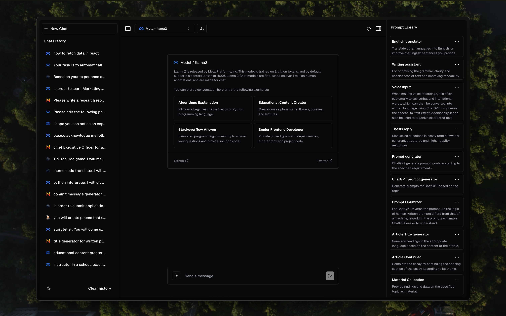

  <!--  -->
  <h1 align="center">InteractAI Hub</h1>



<p align="center" style="padding: 20px 0 ;">
InteractAI Hub provides a simple and easy-to-use interface for interacting with AI models.
</p>

<p align="center">
  <a href="https://www.youtube.com/watch?v=d35tmCKP4ds&ab_channel=PaoloNessim"><strong>Demo Video</strong></a> ·
  <a href="#features"><strong>Features</strong></a> ·
  <a href="#authors"><strong>Roadmap</strong></a> ·
  <a href="#running-locally"><strong>Running locally</strong></a>.
  <a href="#acknowledgments"><strong>Acknowledgments</strong></a>
</p>
<br/>

<p align="center" style="padding: 20px 0 ;">
This project is a work in progress and will be updated with new features and improvements.
</p>

## Features

- [Next.js](https://nextjs.org) App Router
- React Server Components (RSCs), Suspense, and Server Actions
- [Vercel AI SDK](https://sdk.vercel.ai/docs) for streaming chat UI
- [shadcn/ui](https://ui.shadcn.com)
  - Styling with [Tailwind CSS](https://tailwindcss.com)
  - [Radix UI](https://radix-ui.com) for headless component primitives
  - Icons from [Phosphor Icons](https://phosphoricons.com)

## Roadmap

- [] Convert to desktop app using [Tauri](https://tauri.app/)

## Running locally

You will need to use the environment variables [defined in `.env.example`](.env.example)

> Note: You should not commit your `.env` file or it will expose secrets that will allow others to control access to your various OpenAI and authentication provider accounts.

```bash
pnpm install
pnpm dev
```

Your app template should now be running on [localhost:3000](http://localhost:3000/).

## Acknowledgments

This woun't be possible without the following resources:

- [Vercel AI SDK](https://sdk.vercel.ai/docs)
- [Vercel Templates](https://vercel.com/templates)
- [Shadcn UI](https://ui.shadcn.com)
- [Ollama](https://ollama.com)
